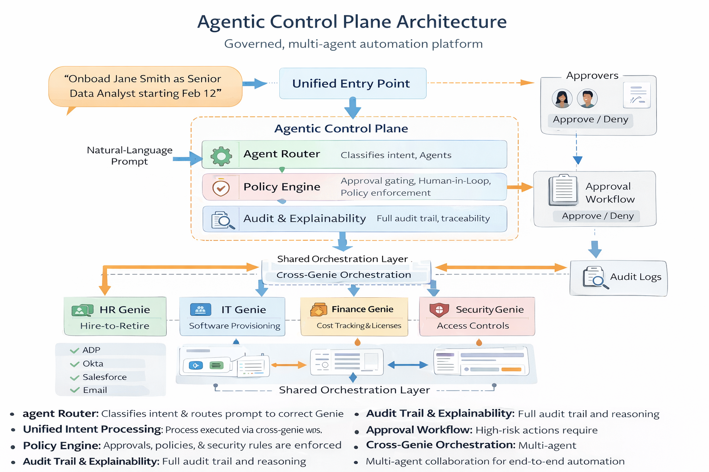
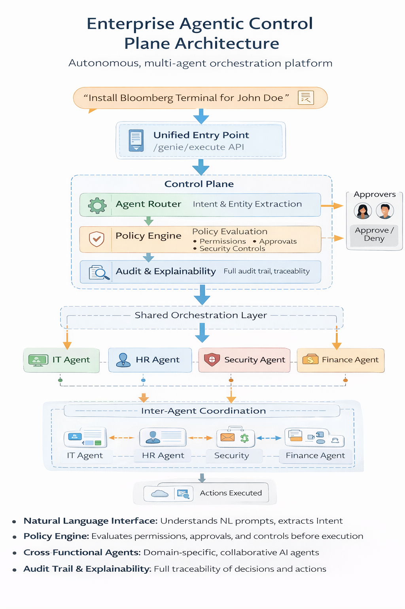

# AutoPilot AI – Workato Genie Lab

© 2026 Tausif Ahmad  
This project is licensed under the MIT License.

> A practical lab for building autonomous AI copilots on top of Workato to automate HR, Finance, IT Ops, and RevOps workflows.

Agentic AI automation portfolio demonstrating how autonomous business agents can be designed using Workato Genie concepts.

This repository showcases production-style AI agents across IT, HR, and Sales domains focusing on intent detection, policy enforcement, and enterprise orchestration.

---

---

## 🏗 Enterprise Agentic Architecture

This portfolio demonstrates how **natural-language prompts are transformed into governed enterprise actions** using a shared agentic control plane.

### 🌐 Global Control Plane

This is the generic architecture used across IT, HR, and Sales.

### 🔄 Control Plane Responsibilities

| Component | Function |
|----------|----------|
| Agent Router | Extracts intent & entities from the prompt |
| Policy Engine | Applies approvals, RBAC, compliance rules |
| Orchestration Engine | Dispatches tasks to domain agents |
| Audit & Explainability | Logs decisions, actions, reasoning |
| Human-in-the-loop | Injects approval steps when required |

---

## 🖥 Example: IT Software Provisioning Genie

Below is a real execution flow for IT self-service automation.

**Example prompt:**
Install Adobe Acrobat for John Doe on his laptop

**Resulting automation:**

- Intent classified → `software_install`
- Software entity extracted → `Adobe Acrobat`
- Policy validated → license availability + role permissions
- IT agent triggered → software provisioning workflow
- Slack notification posted → status update

---

## 🧠 What is an Agentic Automation?

An agentic automation is an AI-driven system that:
- Understands business intent from natural language
- Applies policy & reasoning
- Orchestrates workflows across multiple enterprise platforms
- Operates with minimal human intervention

---

## 📦 Portfolio Modules

| Domain | Agent |
|------|-------|
| IT | Software Provisioning Genie |
| HR | Hire-to-Retire HR Genie |
| Sales | Lead-to-Opportunity Genie |

| Control Plane | Shared routing + policy + guardrails | [View](ControlPlane/) |

---

## 🛠 Technologies & Concepts

- Workato (Recipes, Webhooks, Connectors)
- Workato Genie (Agentic AI Concepts)
- AI by Workato (Prompt-driven reasoning)
- Salesforce, ServiceNow, ADP, Okta, Slack
- Policy-driven automation & governance
-  Human-in-the-loop approvals
- Policy-driven execution & escalation
- Cross-Genie orchestration patterns in [Orchestration](./Orchestration)

---

## 🧠 Genie Portfolio

| Domain | Genie | Screenshots |
|-------|-------|-------------|
| IT | Software Provisioning Genie | [View](#it--software-provisioning-genie) |
| HR | Hire-to-Retire Genie | [View](#hr--hire-to-retire-genie) |
| Sales | Lead-to-Opportunity Genie | [View](#sales--lead-to-opportunity-genie) |

---

## IT – Software Provisioning Genie

**Folder:** `IT/SoftwareProvisioningGenie`

Turns natural language IT requests into automated provisioning workflows.

### Recipe Flow

---

## HR – Hire-to-Retire Genie

**Folder:** `HR/HireToRetireGenie`

Automates employee onboarding and lifecycle actions across HR systems.

### Recipe Flow
)

---

## Sales – Lead-to-Opportunity Genie

**Folder:** `Sales/LeadToOpportunityGenie`

Creates CRM opportunities directly from conversational sales requests.

### Recipe Flow

---

## 🎯 How to Use This Repo

Each module folder contains:
- Architecture overview
- AI prompts
- Intent definitions
- Demo walkthroughs
- Screenshot placeholders for platform evidence

This portfolio demonstrates *design patterns* rather than tool-specific screenshots, allowing it to be portable across enterprise environments.

---

---

## 🧠 Agentic Control Plane Architecture

This platform is not a collection of isolated automations — it is a governed, multi-agent system.

It includes:

- **Agent Router** – classifies natural-language prompts and routes them to the correct Genie  
- **Policy Engine** – enforces governance, approvals, and security controls before execution  
- **Human-in-the-Loop Framework** – approval workflows for high-risk actions  
- **Cross-Genie Orchestration** – HR events automatically trigger IT provisioning  
- **Multi-Agent Collaboration** – HR, IT, Security, and Finance agents coordinate autonomously  
- **Audit & Explainability Layer** – full traceability of every AI decision and action  

**Design artifacts are available in:**

- [ControlPlane](./ControlPlane)
- [Orchestration](./Orchestration) 

This architecture mirrors how production-grade enterprise AI agents must operate at scale.

## 📚 Enterprise Use Case Catalog

A full list of real-world agentic automation use cases across IT, HR, Sales, CX, Marketing, Support, and Security is available here:

👉 [View Use Case Catalog](./USE_CASES.md)

## 👨‍💻 Author

Tausif Ahmad --Integration & Automation Engineer  
